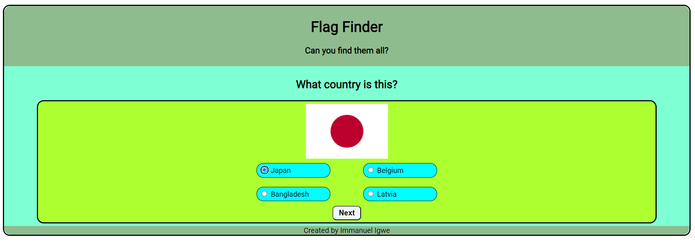

# Flag Finder (Resubmission)

This is a resubmission of the project Flag Finder, which I made as part of my Fullstack Developer course for Code Institute. This resubmission has been made to address issues with my previous submission, which resulted in me obtaining a Fail grade on the project.

## Project Description

Flag Finder is a game, in which the user guesses the country which a flag belongs to. Flags are chosen at random from a list, with a group of four options as to which country the flag could belong to, and the user then has to choose which they believe is the correct one.

## Issues

The main issue was that there was a lack of defensive design in my previous submission. This is shown as to where a user makes an invalid selection (i.e. doesn't pick an option), but is still able to move forward to the next question without any prompting that their selection is invalid. This has now been corrected, with a prompt appearing on the screen when the user clicks the "Next" button without having selected an answer.

The changes were made to the [script.js](assets/js/script.js) file, specifically in the `checkAnswer()` function, where I've added a variable `valid`, which stores a boolean value that is made `true` if the user has selected an option, and the game only progresses if `valid` is `true`.

The next issue that caused my original to obtain a Fail grade was due to poor commit frequency and poor commit messages. This has also been corrected in this resubmission, as I have made smaller commits, along with short and concise commit messages.

## Links

The original repository of the previous submission can be found [here](https://github.com/immanueligwe151/flag-finder).

The live link of the previous submission can be found [here](https://immanueligwe151.github.io/flag-finder/).

The README file of the previous submission, with more details as to the project development can be found [here](https://github.com/immanueligwe151/flag-finder/blob/main/README.md).

The live link for this resubmission can be found [here](https://immanueligwe151.github.io/flag-finder-2/).